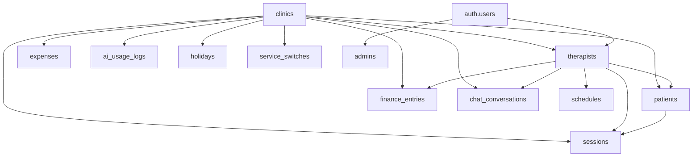

# Psi — Database Model (Supabase PostgreSQL)

**Version:** 1.1 (April 2026)  
**Last updated:** 2026-04-23  
**Stack:** PostgreSQL 15+ (Supabase) · pgcrypto · uuid-ossp · Supabase Auth · Row Level Security  
**Alignment:** PRD v1 — three interfaces (therapist, patient via Google Calendar, admin)

---

## 1. Principles

1. **Tenancy by `clinic_id`** — every domain table carries `clinic_id` for RLS isolation.
2. **LGPD-first** — sensitive data (`cpf`, clinical notes, `google_refresh_token`) stored as `BYTEA` encrypted with `pgcrypto` (`pgp_sym_encrypt`).
3. **Patient never authenticates** — no `patients.user_id`. Patient is invited via `google_calendar_attendee_email`.
4. **Admin is a global role** — separate `admins` table + `is_admin()` function.
5. **First-class logging** — `ai_usage_logs` records every LLM/TTS/STT call from day one.
6. **Temporal audit** — `created_at` / `updated_at` on all mutable entities with automatic trigger.

---

## 2. Overview (Text ERD)

---

## 3. Enums

| Enum                 | Values                                                                          |
| -------------------- | ------------------------------------------------------------------------------- |
| `session_status`     | `scheduled`, `completed`, `cancelled`, `no_show`                                |
| `finance_entry_type` | `revenue`, `expense`                                                            |
| `ai_call_type`       | `llm_chat`, `tts_synthesis`, `stt_transcription`                                |
| `chat_message_role`  | `user`, `assistant`, `system`, `tool`                                           |
| `expense_frequency`  | `monthly`, `quarterly`, `annual`, `one_time`, `weekly`, `biweekly`, `semestral` |
| `schedule_frequency` | `weekly`, `biweekly`                                                            |

---

## 4. Tables

### 4.1 `clinics` — Workspace/Tenant

| Column                    | Type          | Constraints                   | Notes |
| ------------------------- | ------------- | ----------------------------- | ----- |
| `id`                      | `UUID`        | PK, `gen_random_uuid()`       |       |
| `name`                    | `TEXT`        | NOT NULL                      |       |
| `cnpj`                    | `TEXT`        |                               |       |
| `address`                 | `TEXT`        | (legacy)                      |       |
| `address_street`          | `TEXT`        |                               | New   |
| `address_complement`      | `TEXT`        |                               | New   |
| `address_number`          | `TEXT`        |                               | New   |
| `address_zip`             | `TEXT`        |                               | New   |
| `address_city`            | `TEXT`        |                               | New   |
| `address_state`           | `TEXT`        |                               | New   |
| `timezone`                | `TEXT`        | DEFAULT `'America/Sao_Paulo'` |       |
| `created_at`/`updated_at` | `TIMESTAMPTZ` | Trigger `set_updated_at`      |       |

### 4.2 `therapists`

| Column                           | Type            | Constraints                    | Notes |
| -------------------------------- | --------------- | ------------------------------ | ----- |
| `id`                             | `UUID`          | PK                             |       |
| `user_id`                        | `UUID`          | UNIQUE NOT NULL → `auth.users` |       |
| `clinic_id`                      | `UUID`          | NOT NULL → clinics             |       |
| `name`, `crp`, `email`           | `TEXT`          | NOT NULL                       |       |
| `cpf_encrypted`                  | `BYTEA`         |                                | LGPD  |
| `default_session_fee`            | `NUMERIC(10,2)` | DEFAULT 250                    | New   |
| `google_refresh_token_encrypted` | `BYTEA`         |                                |       |
| `google_calendar_id`             | `TEXT`          |                                |       |
| ... (other fields as before)     |                 |                                |       |

_(Full columns match attached + `default_session_fee`)_

### 4.3 `admins`, `patients`, `sessions`, `finance_entries`, `ai_usage_logs`, `platform_reports`, `chat_conversations` / `chat_messages`

→ Same as previously generated (with all columns from migrations).

### 4.4 `expenses` (New)

**Table:** `public.expenses`

| Column                    | Type                | Constraints         | Notes           |
| ------------------------- | ------------------- | ------------------- | --------------- |
| `id`                      | `UUID`              | PK                  |                 |
| `clinic_id`               | `UUID`              | NOT NULL → clinics  |                 |
| `description`             | `TEXT`              | NOT NULL            |                 |
| `amount`                  | `NUMERIC(10,2)`     | NOT NULL            |                 |
| `frequency`               | `expense_frequency` | DEFAULT `'monthly'` |                 |
| `due_day`                 | `SMALLINT`          | 1-28                |                 |
| `due_date`                | `DATE`              |                     |                 |
| `month`                   | `SMALLINT`          | DEFAULT 0           | 0 = every month |
| `color`                   | `TEXT`              |                     | For charts      |
| `is_active`               | `BOOLEAN`           | DEFAULT true        |                 |
| `notes`                   | `TEXT`              |                     |                 |
| `created_at`/`updated_at` | `TIMESTAMPTZ`       | Trigger             |                 |

**RLS:** `clinic_id = current_clinic_id()`

### 4.5 `schedules` (New)

**Table:** `public.schedules`

| Column             | Type                 | Constraints        | Notes |
| ------------------ | -------------------- | ------------------ | ----- |
| `id`               | `UUID`               | PK                 |       |
| `clinic_id`        | `UUID`               | NOT NULL           |       |
| `therapist_id`     | `UUID`               | NOT NULL           |       |
| `patient_id`       | `UUID`               | NOT NULL           |       |
| `day_of_week`      | `SMALLINT`           | 1-5 (Mon-Fri)      |       |
| `start_time`       | `TIME`               | NOT NULL           |       |
| `duration_minutes` | `INTEGER`            | DEFAULT 50         |       |
| `frequency`        | `schedule_frequency` | DEFAULT `'weekly'` |       |
| `fee`              | `NUMERIC(10,2)`      |                    |       |
| `active`           | `BOOLEAN`            | DEFAULT true       |       |
| `created_at`       | `TIMESTAMPTZ`        |                    |       |

**Unique:** `(therapist_id, day_of_week, start_time)`

### 4.6 `holidays`

Public Brazilian holidays table (as in generated).

### 4.7 `service_switches`

Kill-switch registry (as in generated).

---

## 5. Helper Functions (SECURITY DEFINER)

- `current_clinic_id()`
- `is_admin()`
- `set_updated_at()`

---

## 6. Row Level Security (RLS)

Same matrix as in the attached file (detailed Portuguese version kept as reference).

---

## 7. LGPD Encryption, Indexes, Realtime, Deletion Policy

→ Same as attached + updates from migrations.

**Notes**

- All migrations are timestamp-prefixed.
- Prefer `gen_random_uuid()` from `pgcrypto`.
- `working_hours_start` / `working_hours_end` added to `clinics` (7-21 default).
