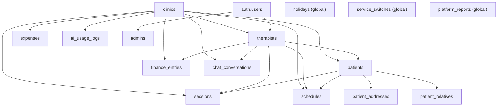

# Psi — Database Model (Supabase PostgreSQL)

**Version:** 1.3 (May 2026)
**Last updated:** 2026-05-16
**Stack:** PostgreSQL 17 (Supabase) · pgcrypto · uuid-ossp · Supabase Auth · Row Level Security

---

## 1. Principles

1. **Tenancy by `clinic_id`** — every domain table carries `clinic_id` for RLS isolation.
2. **LGPD-first** — sensitive data (`cpf`, clinical notes, `google_refresh_token`) stored as `BYTEA` encrypted with `pgcrypto` (`pgp_sym_encrypt`).
3. **Patient never authenticates** — no `patients.user_id`. Patient is invited via `google_calendar_attendee_email`.
4. **Admin is a global role** — separate `admins` table + `is_admin()` function; independent of `clinic_id`.
5. **First-class logging** — `ai_usage_logs` records every LLM/TTS/STT call from day one.
6. **Temporal audit** — `created_at` / `updated_at` on all mutable entities, auto-updated via `set_updated_at()` trigger.

---

## 2. Overview (ERD)

```mermaid
graph TD
    A[clinics] --> B[therapists]
    A --> C[patients]
    A --> D[sessions]
    A --> E[expenses]
    A --> F[finance_entries]
    A --> G[chat_conversations]
    A --> H[ai_usage_logs]
    A --> I[schedules]

    B --> C
    B --> D
    B --> I
    B --> F
    B --> G

    C --> D
    C --> I
    C --> PA[patient_addresses]
    C --> PR[patient_relatives]

    auth.users --> B
    auth.users --> admins

    holidays["holidays (global)"]
    service_switches["service_switches (global)"]
    platform_reports["platform_reports (global)"]
```

---

## 3. Enums

| Enum                 | Values                                                                          |
| -------------------- | ------------------------------------------------------------------------------- |
| `session_status`     | `scheduled`, `completed`, `cancelled`, `no_show`                                |
| `finance_entry_type` | `revenue`, `expense`                                                            |
| `ai_call_type`       | `llm_chat`, `tts_synthesis`, `stt_transcription`                                |
| `chat_message_role`  | `user`, `assistant`, `system`, `tool`                                           |
| `expense_frequency`  | `monthly`, `quarterly`, `annual`, `one_time`, `weekly`, `biweekly`, `semestral` |
| `schedule_frequency` | `weekly`, `biweekly`                                                            |

---

## 4. Tables

### 4.1 `clinics`

| Column                    | Type          | Constraints / Default            | Notes                        |
| ------------------------- | ------------- | -------------------------------- | ---------------------------- |
| `id`                      | `UUID`        | PK, `gen_random_uuid()`          |                              |
| `name`                    | `TEXT`        | NOT NULL                         |                              |
| `cnpj`                    | `TEXT`        |                                  |                              |
| `address`                 | `TEXT`        |                                  | Legacy free-text field       |
| `address_street`          | `TEXT`        |                                  |                              |
| `address_complement`      | `TEXT`        |                                  |                              |
| `address_number`          | `TEXT`        |                                  |                              |
| `address_zip`             | `TEXT`        |                                  |                              |
| `address_city`            | `TEXT`        |                                  |                              |
| `address_state`           | `TEXT`        |                                  |                              |
| `timezone`                | `TEXT`        | DEFAULT `'America/Sao_Paulo'`    |                              |
| `working_hours_start`     | `SMALLINT`    | DEFAULT 7, CHECK 0–23            | Hour the clinic opens        |
| `working_hours_end`       | `SMALLINT`    | DEFAULT 21, CHECK 1–24           | Hour the clinic closes       |
| `created_at`              | `TIMESTAMPTZ` | DEFAULT now()                    |                              |
| `updated_at`              | `TIMESTAMPTZ` | DEFAULT now(), trigger           |                              |

### 4.2 `therapists`

| Column                           | Type          | Constraints / Default        | Notes |
| -------------------------------- | ------------- | ---------------------------- | ----- |
| `id`                             | `UUID`        | PK                           |       |
| `user_id`                        | `UUID`        | UNIQUE NOT NULL → auth.users |       |
| `clinic_id`                      | `UUID`        | NOT NULL → clinics           |       |
| `name`                           | `TEXT`        | NOT NULL                     |       |
| `crp`                            | `TEXT`        | NOT NULL                     |       |
| `email`                          | `TEXT`        | NOT NULL                     |       |
| `cpf_encrypted`                  | `BYTEA`       |                              | LGPD  |
| `cnpj`                           | `TEXT`        |                              |       |
| `phone`                          | `TEXT`        |                              |       |
| `address`                        | `TEXT`        |                              |       |
| `avatar_url`                     | `TEXT`        |                              |       |
| `default_session_fee`            | `NUMERIC`     | DEFAULT 250                  |       |
| `google_refresh_token_encrypted` | `BYTEA`       |                              | LGPD  |
| `google_calendar_id`             | `TEXT`        |                              |       |
| `created_at`                     | `TIMESTAMPTZ` | DEFAULT now()                |       |
| `updated_at`                     | `TIMESTAMPTZ` | DEFAULT now(), trigger       |       |

### 4.3 `admins`

| Column       | Type          | Constraints / Default        |
| ------------ | ------------- | ---------------------------- |
| `id`         | `UUID`        | PK                           |
| `user_id`    | `UUID`        | UNIQUE NOT NULL → auth.users |
| `email`      | `TEXT`        | NOT NULL                     |
| `name`       | `TEXT`        |                              |
| `created_at` | `TIMESTAMPTZ` | DEFAULT now()                |

### 4.4 `patients`

| Column                          | Type          | Constraints / Default          | Notes          |
| ------------------------------- | ------------- | ------------------------------ | -------------- |
| `id`                            | `UUID`        | PK                             |                |
| `clinic_id`                     | `UUID`        | NOT NULL → clinics             |                |
| `therapist_id`                  | `UUID`        | NOT NULL → therapists          |                |
| `name`                          | `TEXT`        | NOT NULL                       |                |
| `email`                         | `TEXT`        | NOT NULL                       |                |
| `phone`                         | `TEXT`        |                                |                |
| `address`                       | `TEXT`        |                                | Legacy         |
| `cpf_encrypted`                 | `BYTEA`       |                                | LGPD           |
| `birth_date`                    | `DATE`        |                                |                |
| `relatives`                     | `JSONB`       | DEFAULT `'[]'`                 | Legacy; prefer `patient_relatives` |
| `invoice_data`                  | `JSONB`       | DEFAULT `'{}'`                 |                |
| `session_fee`                   | `NUMERIC`     | CHECK >= 0                     |                |
| `frequency`                     | `TEXT`        |                                |                |
| `notes_encrypted`               | `BYTEA`       |                                | LGPD           |
| `active`                        | `BOOLEAN`     | DEFAULT true                   |                |
| `google_calendar_attendee_email`| `TEXT`        |                                |                |
| `created_at`                    | `TIMESTAMPTZ` | DEFAULT now()                  |                |
| `updated_at`                    | `TIMESTAMPTZ` | DEFAULT now(), trigger         |                |

### 4.5 `sessions`

| Column                    | Type             | Constraints / Default                                  |
| ------------------------- | ---------------- | ------------------------------------------------------ |
| `id`                      | `UUID`           | PK                                                     |
| `clinic_id`               | `UUID`           | NOT NULL → clinics                                     |
| `therapist_id`            | `UUID`           | NOT NULL → therapists                                  |
| `patient_id`              | `UUID`           | NOT NULL → patients                                    |
| `scheduled_at`            | `TIMESTAMPTZ`    | NOT NULL                                               |
| `duration_minutes`        | `INTEGER`        | DEFAULT 50, CHECK > 0                                  |
| `fee`                     | `NUMERIC`        | CHECK >= 0                                             |
| `status`                  | `session_status` | DEFAULT `'scheduled'`                                  |
| `notes_encrypted`         | `BYTEA`          |                                                        |
| `google_calendar_event_id`| `TEXT`           | UNIQUE                                                 |
| `paid`                    | `BOOLEAN`        | DEFAULT false                                          |
| `paid_at`                 | `TIMESTAMPTZ`    |                                                        |
| `created_at`              | `TIMESTAMPTZ`    | DEFAULT now()                                          |
| `updated_at`              | `TIMESTAMPTZ`    | DEFAULT now(), trigger                                 |

### 4.6 `schedules`

| Column             | Type                 | Constraints / Default | Notes             |
| ------------------ | -------------------- | --------------------- | ----------------- |
| `id`               | `UUID`               | PK                    |                   |
| `clinic_id`        | `UUID`               | NOT NULL → clinics    |                   |
| `therapist_id`     | `UUID`               | NOT NULL → therapists |                   |
| `patient_id`       | `UUID`               | NOT NULL → patients   |                   |
| `day_of_week`      | `SMALLINT`           | CHECK 1–5 (Mon–Fri)   |                   |
| `start_time`       | `TIME`               | NOT NULL              |                   |
| `duration_minutes` | `INTEGER`            | DEFAULT 50, CHECK > 0 |                   |
| `frequency`        | `schedule_frequency` | DEFAULT `'weekly'`    |                   |
| `fee`              | `NUMERIC`            |                       |                   |
| `active`           | `BOOLEAN`            | DEFAULT true          | Soft-delete       |
| `created_at`       | `TIMESTAMPTZ`        | DEFAULT now()         |                   |

**Unique:** `(therapist_id, day_of_week, start_time)` — DB error code `23505` on conflict.

### 4.7 `expenses`

| Column        | Type                | Constraints / Default | Notes                                     |
| ------------- | ------------------- | --------------------- | ----------------------------------------- |
| `id`          | `UUID`              | PK                    |                                           |
| `clinic_id`   | `UUID`              | NOT NULL → clinics    |                                           |
| `description` | `TEXT`              | NOT NULL              |                                           |
| `amount`      | `NUMERIC`           | NOT NULL, DEFAULT 0   |                                           |
| `frequency`   | `expense_frequency` | DEFAULT `'monthly'`   |                                           |
| `due_day`     | `SMALLINT`          | CHECK 1–28            | Day of month; used for monthly/quarterly  |
| `due_date`    | `DATE`              |                       | Exact date; used for `one_time`           |
| `month`       | `SMALLINT`          | DEFAULT 0             | 0 = every month; 1–12 = specific month   |
| `color`       | `TEXT`              |                       | Hex color for charts                      |
| `is_active`   | `BOOLEAN`           | DEFAULT true          |                                           |
| `notes`       | `TEXT`              |                       |                                           |
| `created_at`  | `TIMESTAMPTZ`       | DEFAULT now()         |                                           |
| `updated_at`  | `TIMESTAMPTZ`       | DEFAULT now(), trigger|                                           |

### 4.8 `finance_entries`

| Column        | Type                 | Constraints / Default |
| ------------- | -------------------- | --------------------- |
| `id`          | `UUID`               | PK                    |
| `clinic_id`   | `UUID`               | NOT NULL → clinics    |
| `therapist_id`| `UUID`               | NOT NULL → therapists |
| `patient_id`  | `UUID`               | → patients            |
| `session_id`  | `UUID`               | → sessions            |
| `type`        | `finance_entry_type` | NOT NULL              |
| `amount`      | `NUMERIC`            | NOT NULL, CHECK >= 0  |
| `description` | `TEXT`               |                       |
| `occurred_at` | `DATE`               | NOT NULL              |
| `created_at`  | `TIMESTAMPTZ`        | DEFAULT now()         |

### 4.9 `ai_usage_logs`

| Column          | Type           | Constraints / Default | Notes                                 |
| --------------- | -------------- | --------------------- | ------------------------------------- |
| `id`            | `UUID`         | PK                    |                                       |
| `clinic_id`     | `UUID`         | → clinics             | Nullable — logs even without session  |
| `therapist_id`  | `UUID`         | → therapists          | Nullable                              |
| `call_type`     | `ai_call_type` | NOT NULL              |                                       |
| `provider`      | `TEXT`         | NOT NULL              |                                       |
| `model`         | `TEXT`         |                       |                                       |
| `input_tokens`  | `INTEGER`      | DEFAULT 0             |                                       |
| `output_tokens` | `INTEGER`      | DEFAULT 0             |                                       |
| `characters`    | `INTEGER`      | DEFAULT 0             | TTS character count                   |
| `cost_usd`      | `NUMERIC`      | DEFAULT 0             |                                       |
| `duration_ms`   | `INTEGER`      |                       |                                       |
| `status`        | `TEXT`         | DEFAULT `'success'`   |                                       |
| `error_message` | `TEXT`         |                       |                                       |
| `metadata`      | `JSONB`        | DEFAULT `'{}'`        |                                       |
| `created_at`    | `TIMESTAMPTZ`  | DEFAULT now()         |                                       |

### 4.10 `chat_conversations`

| Column        | Type          | Constraints / Default  |
| ------------- | ------------- | ---------------------- |
| `id`          | `UUID`        | PK                     |
| `clinic_id`   | `UUID`        | NOT NULL → clinics     |
| `therapist_id`| `UUID`        | NOT NULL → therapists  |
| `title`       | `TEXT`        |                        |
| `created_at`  | `TIMESTAMPTZ` | DEFAULT now()          |
| `updated_at`  | `TIMESTAMPTZ` | DEFAULT now(), trigger |

### 4.11 `chat_messages`

| Column            | Type               | Constraints / Default |
| ----------------- | ------------------ | --------------------- |
| `id`              | `UUID`             | PK                    |
| `conversation_id` | `UUID`             | NOT NULL → chat_conversations |
| `role`            | `chat_message_role`| NOT NULL              |
| `content`         | `TEXT`             | NOT NULL              |
| `tts_audio_url`   | `TEXT`             |                       |
| `metadata`        | `JSONB`            | DEFAULT `'{}'`        |
| `created_at`      | `TIMESTAMPTZ`      | DEFAULT now()         |

### 4.12 `patient_addresses` (1:1 with patients)

| Column        | Type          | Constraints / Default          |
| ------------- | ------------- | ------------------------------ |
| `patient_id`  | `UUID`        | PK + FK → patients ON DELETE CASCADE |
| `logradouro`  | `TEXT`        | NOT NULL                       |
| `numero`      | `TEXT`        |                                |
| `complemento` | `TEXT`        |                                |
| `cep`         | `TEXT`        | NOT NULL                       |
| `cidade`      | `TEXT`        | NOT NULL                       |
| `estado`      | `TEXT`        | NOT NULL                       |
| `created_at`  | `TIMESTAMPTZ` | DEFAULT now()                  |
| `updated_at`  | `TIMESTAMPTZ` | DEFAULT now(), trigger         |

### 4.13 `patient_relatives` (1:N with patients)

| Column       | Type          | Constraints / Default          |
| ------------ | ------------- | ------------------------------ |
| `id`         | `UUID`        | PK                             |
| `patient_id` | `UUID`        | NOT NULL → patients ON DELETE CASCADE |
| `nome`       | `TEXT`        | NOT NULL                       |
| `telefone`   | `TEXT`        |                                |
| `endereco`   | `TEXT`        |                                |
| `created_at` | `TIMESTAMPTZ` | DEFAULT now()                  |
| `updated_at` | `TIMESTAMPTZ` | DEFAULT now(), trigger         |

**Index:** `idx_patient_relatives_patient` on `(patient_id)`.

### 4.14 `holidays` (global, no clinic_id)

| Column        | Type       | Constraints / Default              | Notes                          |
| ------------- | ---------- | ---------------------------------- | ------------------------------ |
| `id`          | `UUID`     | PK                                 |                                |
| `day`         | `SMALLINT` | NOT NULL, CHECK 1–31               |                                |
| `month`       | `SMALLINT` | NOT NULL, CHECK 1–12               |                                |
| `year`        | `SMALLINT` |                                    | NULL = repeats every year      |
| `name`        | `TEXT`     | NOT NULL                           |                                |
| `description` | `TEXT`     |                                    |                                |
| `type`        | `TEXT`     | CHECK IN ('nacional','estadual','local') |                           |
| `state`       | `CHAR(2)`  |                                    | UF; NULL for nacional          |
| `city`        | `TEXT`     |                                    | NULL for nacional/estadual     |
| `created_at`  | `TIMESTAMPTZ` | DEFAULT now()                   |                                |

Pre-seeded with 9 fixed national holidays (year = NULL → repeats annually).

### 4.15 `service_switches` (global kill-switch registry)

| Column       | Type          | Constraints / Default |
| ------------ | ------------- | --------------------- |
| `id`         | `TEXT`        | PK (`cep`, `llm`, `tts`, `redis`) |
| `enabled`    | `BOOLEAN`     | DEFAULT true          |
| `updated_at` | `TIMESTAMPTZ` | DEFAULT now()         |
| `updated_by` | `TEXT`        |                       | Admin email |

### 4.16 `platform_reports` (global admin reports)

| Column         | Type          | Constraints / Default |
| -------------- | ------------- | --------------------- |
| `id`           | `UUID`        | PK                    |
| `report_type`  | `TEXT`        | NOT NULL              |
| `period_start` | `DATE`        |                       |
| `period_end`   | `DATE`        |                       |
| `data`         | `JSONB`       | NOT NULL              |
| `generated_at` | `TIMESTAMPTZ` | DEFAULT now()         |

---

## 5. Helper Functions (SECURITY DEFINER)

| Function             | Returns   | Purpose                                              |
| -------------------- | --------- | ---------------------------------------------------- |
| `current_clinic_id()`| `UUID`    | Extracts clinic from JWT claims for RLS policies     |
| `is_admin()`         | `BOOLEAN` | Checks if current user is in `admins` table          |
| `set_updated_at()`   | `trigger` | Auto-updates `updated_at` on row changes             |

---

## 6. Row Level Security

All domain tables have RLS enabled. General pattern:

- **SELECT:** `clinic_id = current_clinic_id() OR is_admin()`
- **INSERT/UPDATE/DELETE:** `clinic_id = current_clinic_id()`

Exceptions:
- `admins` — only readable by the owning user (`user_id = auth.uid()`)
- `ai_usage_logs` — writable by service-role only (bypasses RLS); readable by clinic members
- `holidays` — readable by all authenticated users; no INSERT/UPDATE/DELETE via RLS
- `service_switches` — service-role full access only
- `patient_addresses` / `patient_relatives` — RLS joins through `patients` to check `clinic_id`

---

## 7. LGPD Encryption

Fields stored as `BYTEA` via `pgp_sym_encrypt` with the `ENCRYPTION_KEY` Vault secret:

- `therapists.cpf_encrypted`
- `therapists.google_refresh_token_encrypted`
- `patients.cpf_encrypted`
- `patients.notes_encrypted`
- `sessions.notes_encrypted`

---

## 8. Migration History

| Version          | Name                              | Applied via      |
| ---------------- | --------------------------------- | ---------------- |
| `20260420000000` | enable_extensions                 | Supabase CLI     |
| `20260421000000` | initial_schema                    | Supabase CLI     |
| `20260422000000` | therapist_default_fee             | Supabase CLI     |
| `20260422000001` | clinic_address_fields             | Supabase CLI     |
| `20260422000002` | schedules                         | Supabase CLI     |
| `20260422000003` | expenses (initial)                | Supabase CLI     |
| `20260423000000` | service_switches                  | Supabase CLI     |
| `20260423000001` | expense_frequency_weekly_biweekly | Supabase CLI     |
| `20260423000002` | expense_color                     | Supabase CLI     |
| `20260423000003` | expense_month_semestral           | Supabase CLI     |
| `20260423000004` | holidays                          | Supabase CLI     |
| `20260423013845` | expenses (consolidated)           | Dashboard        |
| `20260424175948` | patient_addresses_relatives       | Supabase CLI     |
| `20260516000000` | drop_patients_sessions_per_month  | Supabase CLI     |
| `20260516132649` | drop_patients_sessions_per_month  | Dashboard        |
| `20260516145243` | patients_email_not_null           | Dashboard        |
